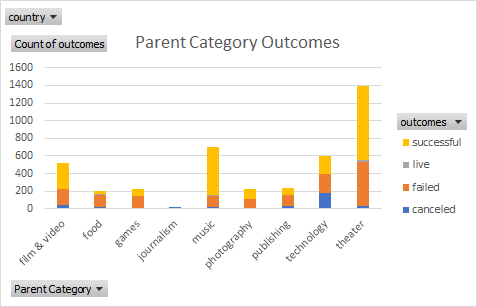
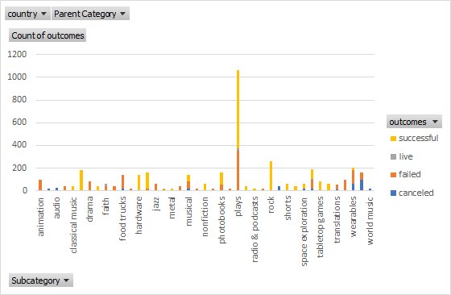
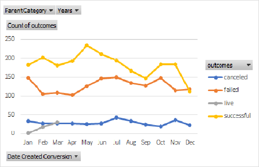
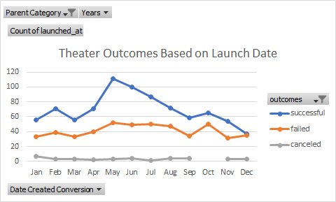
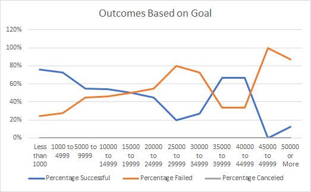

# An Analysis of Kickstarter Campaigns

##Overview of Project
1. An analysis of kickstarter campaigns from different countries was conducted to predict the outcome of a future kickstart campaign. Various forms of entertainment were observed and analyzed utilizing data on their outcomes, campaign goals, and launch dates. Based on the data from the Cateogory Statistics chart, campaigns in the theater catoegory had the most chances of success in reaching their campaign goals. When taking a look at Subcategory Outcomes chart, plays specifically in the theater category had a higher success rate than others. The success of kickstarter campaigns, especially in May, were the highest during the month of May when looking at data from Outcomes Based on Launch Date. To summarize the points, play kickstarter campaigns are the most successful in May.

 

I had a bit of trouble with conditional formatting using color scales. However this was mostly in part because I could not see the color transition, so I was able to fix this confusion by searching it up and also filtering the column differently till I could see a color transition. I also had difficulties understanding how to place the correct fields into the pivot chart categories. In order to overcome this, I went over the module as well as the exercise that was done in class before practicing on my own. 

Data from Theater_Outcomes_vs_Launch chart indicates that the highest number of campaigns are launched in May resulting in a large number of successful campaigns. The amount of successful and failed campaigns are roughly the same during the later months in the year, starting around October and ending about January. There are also barely any cases of canceled campaigns in for each month.

Looking at the data from Outcomes_vs_Goals chart the largest number of successful and failed kickstarter campaigns were those with goals of 1000 to 4999, however the highest percentage of successful campaigns were those with goals of less than 1000. There were a total of 0 canceled campaigns for all categories of goal ranges. 

The dataset lacks data on the target population and sample size of the campaigns. There is no way to know the age, gender, or socioeconomic status of the individuals that these campaigns were targetting and so there are holes in the data that could potentially aid in the analysis to explain why a campaign was a success or a failure.

Additionally, charts and tables for "outcomes_vs_deadline" and "goal_vs_deadline" could have been added to observe if the duration of a campaign affected its success. 
