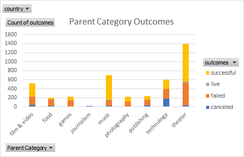

# An Analysis of Kickstarter Campaigns
An analysis of kickstarter campaigns from different countries was conducted to predict the outcome of a future kickstart campaign. 
According to the findings, theather campaigns, specifically play kickstarter campaigns have the highest rate of successful outcomes. The trends also show that the highest chances of success for kickstart campaigns are in the month of May.

![Subcategory Outcomes]
!Outcomes Based on Launch Date]
